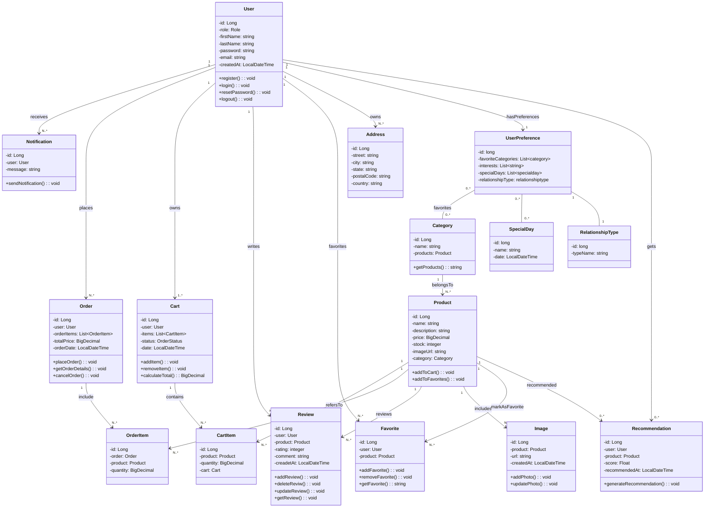
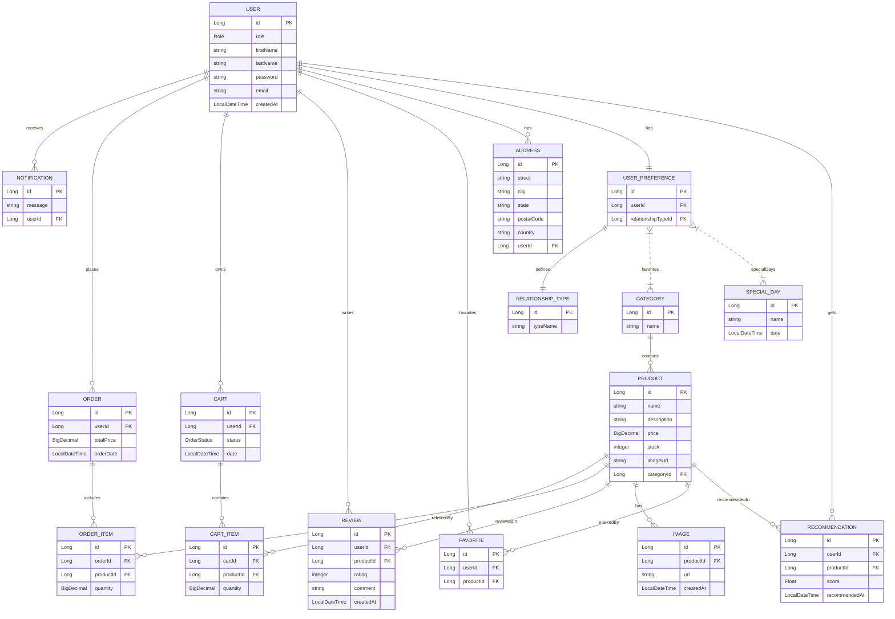

# Beloved

## 1. Proje Tanımı  
Beloved, kullanıcıların sevdiklerine en uygun hediyeyi zahmetsizce bulmalarını sağlayan yapay zeka destekli bir hediye platformudur. Akıllı öneri sistemi sayesinde hediye seçme sürecini hem kolay hem de keyifli hale getirir. Kişisel tercihler, özel günler ve ilişki türü gibi kriterleri dikkate alarak, her kullanıcıya özel öneriler sunar.

## 2. Proje Amacı  
Beloved e-ticaret platformunun temel amacı, kullanıcıların hediye seçme sürecini kolaylaştırarak özel günlerini daha anlamlı kılmak ve kişiler arasındaki duygusal bağları güçlendirmektir. Yapay zeka destekli öneri sistemi sayesinde kullanıcılar, sevdiklerinin ilgi alanlarına ve ilişki dinamiklerine uygun kişiselleştirilmiş hediye önerileri alabilir. Ayrıca, dijital hediye kartları oluşturma imkânı sunarak esnek ve modern bir hediyeleşme deneyimi sağlar.

## 3. Proje Kapsamı  
- Yapay zeka destekli hediye öneri sistemi  
- Kişiye özel filtreleme (ilgi alanı, ilişki türü, özel günler)  
- Dijital hediye kartı oluşturma  
- Kolay ve şık kullanıcı arayüzü  
- Online gönderim seçenekleri  

## 4. Kullanılan Teknolojiler  

### 4.1 Backend  
- **Spring Boot:** Uygulamanın temel sunucu tarafı ve RESTful servisler için  
- **FastAPI:** Yapay zeka öneri sistemi için hızlı ve asenkron bir framework

### 4.2 Frontend  
- **React:** Kullanıcı dostu, dinamik bir arayüz tasarımı için  
- **Bootstrap:** Responsive tasarım öğeleri ile şık bir arayüz  

### 4.3 Veritabanı  
- **PostgreSQL:** Güçlü ve ölçeklenebilir açık kaynaklı ilişkisel veritabanı sistemi

## 5. UML Diyagramı

## 6. ER Diyagramı

## 7. İş Planı
## Hafta 1: Proje Planlama ve Analiz  
- Projenin tanımı, amacı ve kapsamını belirleme  
- ER ve UML Class diyagramlarının oluşturulması  
- GitHub repolarının açılması ve temel yapıların hazırlanması  

## Hafta 2: Temel Kurulumlar ve Tasarım  
- Backend (Spring Boot) ve frontend (React) projelerinin oluşturulması  
- PostgreSQL bağlantısının kurulması  
- UX/UI tasarımının belirlenmesi  
- Frontend’de anasayfa tasarımının yapılması  

## Hafta 3: Entity Tasarımı ve CRUD API Geliştirme  
- User, Notification, Order, OrderItem, Cart, CartItem, Product, Review, Category, Image, Favorite, Address, UserPreference, SpecialDay, RelationshipType, Recommendation entitylerinin oluşturulması  
- Controller, Service ve Repository katmanlarının hazırlanması  
- CRUD operasyonlarının geliştirilmesi:  
  - User: kayıt, giriş, listeleme, çıkış  
  - Product: ekleme, güncelleme, silme, listeleme  
  - Category: ekleme, güncelleme, silme, listeleme  
- API’ların Postman ile test edilmesi  

## Hafta 4: Kullanıcı Yönetimi ve Kimlik Doğrulama  
- Spring Security ve JWT ile kimlik doğrulama ve yetkilendirme  
- Kullanıcı kayıt ve giriş API’larının tamamlanması  
- Frontend’de kullanıcı kayıt ve giriş sayfalarının oluşturulması  
- Anasayfa tasarımının geliştirilmesi  

## Hafta 5: Kullanıcı Profili Geliştirme  
- Kullanıcı bilgilerini görüntüleme ve güncelleme API’larının hazırlanması  
- Frontend’de kullanıcı profil sayfasının oluşturulması  
- Kullanıcı profili için frontend ve backend entegrasyonunun tamamlanması  

## Hafta 6: Ürün, Kategori ve Sepet Yönetimi  
- Sepete ürün ekleme, silme ve listeleme API’larının geliştirilmesi  
- Sipariş oluşturma, silme ve görüntüleme API’larının hazırlanması  
- Ürün görüntüleme, listeleme ve filtreleme API’larının tamamlanması  

## Hafta 7: Sepet ve Sipariş Yönetimi Frontend  
- React üzerinde sepete ekleme, sepet görüntüleme ve sipariş oluşturma sayfalarının oluşturulması  
- Kullanıcı profilinde sipariş geçmişi sayfasının hazırlanması  
- Sepet ve sipariş yönetimi için frontend-backend entegrasyonunun tamamlanması  

## Hafta 8: Favori, Yorum ve Admin Paneli  
- Favorite ve Review API’larının oluşturulması  
- Admin API’larının geliştirilmesi (ürün/kategori/sipariş yönetimi, bildirim gönderme)  
- Frontend’de admin panel sayfalarının tamamlanması  
- Bildirim (Notification) API’larının geliştirilmesi ve entegrasyonu  
